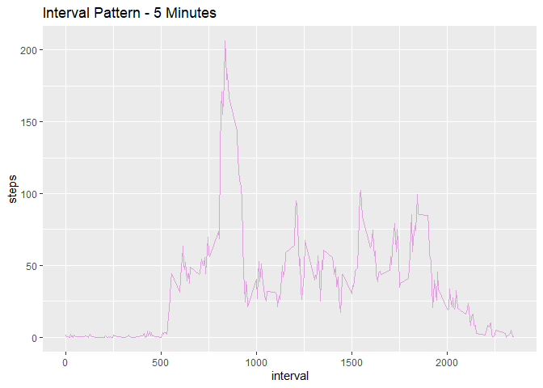

## Introduction
It is now possible to collect a large amount of data about personal movement using activity monitoring devices such as a [Fitbit](https://www.fitbit.com/home), [Nike Fuelband](https://www.nike.com/us/en_us/c/nikeplus-fuelband), or [Jawbone Up](https://jawbone.com/up). These type of devices are part of the “quantified self” movement – a group of enthusiasts who take measurements about themselves regularly to improve their health, to find patterns in their behavior, or because they are tech geeks. But these data remain under-utilized both because the raw data are hard to obtain and there is a lack of statistical methods and software for processing and interpreting the data.

This assignment makes use of data from a personal activity monitoring device. This device collects data at 5 minute intervals through out the day. The data consists of two months of data from an anonymous individual collected during the months of October and November, 2012 and include the number of steps taken in 5 minute intervals each day.

The data for this assignment can be downloaded from the course web site:

* Dataset: [Activity monitoring data](https://d396qusza40orc.cloudfront.net/repdata%2Fdata%2Factivity.zip) [52K]

The variables included in this dataset are:

- **steps**: Number of steps taking in a 5-minute interval (missing values are coded as *NA*) </br>
- **date**: The date on which the measurement was taken in YYYY-MM-DD format </br>
- **interval**: Identifier for the 5-minute interval in which measurement was taken </br>
The dataset is stored in a comma-separated-value (CSV) file and there are a total of 17,568 observations in this dataset.


## Load required packages for the project

```r
library(knitr)
library(dplyr)
library(tidyverse)
library(lubridate)
library(ggplot2)
```

## Load data and read csv into a dataframe called activity_data

```r
unzip("activity.zip")
activity_data <- read.csv("activity.csv", header = TRUE, sep = ',', colClasses = c("numeric", "character", "integer"))
```


## Histogram of total number of steps taken each day

```r
steps <- activity_data %>%
    filter(!is.na(steps)) %>%
    group_by(date) %>%
    summarize(steps = sum(steps))


ggplot(steps, aes(x = steps)) +
    geom_histogram(fill = "steelblue1", binwidth = 1000) +
    labs(title = "Steps Per day", x = "Steps per day", y = "Frequency")
```

<!-- -->


## Mean and median of number of steps taken each day

```r
mean_steps <- mean(steps$steps, na.rm = TRUE)
median_steps <- median(steps$steps, na.rm = TRUE)
```
The mean is 9354.23 steps per day and the median is 10395 steps per day.

## Time Series plot of the average number of steps taken in a day

```r
interval_pattern <- activity_data %>%
    filter(!is.na(steps)) %>%
    group_by(interval) %>%
    summarize(steps = mean(steps))

ggplot(interval_pattern, aes(x=interval, y=steps)) +
    geom_line(color = "plum") + labs(title = "Interval Pattern - 5 Minutes")
```

<!-- -->

On average, the most active 5-minute interval was that commencing at 2020-02-24 08:35:00 with a mean step count of 206.1698113

## The 5-minute interval that on average contains the maximum number of steps

```r
interval_pattern[which.max(interval_pattern$steps),]
```

```
## # A tibble: 1 x 2
##   interval steps
##      <int> <dbl>
## 1      835  206.
```

## Calulate how many misingvalues are present in the data

```r
sum(is.na(activity_data$steps))
```

```
## [1] 2304
```


## Input missing data

```r
complete_data <- activity_data
na <- is.na(complete_data$steps)
average_interval <- tapply(complete_data$steps, complete_data$interval, mean, na.rm = TRUE, simplify = TRUE)
complete_data$steps[na] <- average_interval[as.character(complete_data$interval[na])]
```

## Do we have any NAs in the data set check

```r
sum(is.na(complete_data$steps))
```

```
## [1] 0
```


## Histogram of the total number of steps taken each day after missing values were imputed

```r
steps_full <- complete_data %>%
    filter(!is.na(steps)) %>%
    group_by(date) %>%
    summarize(steps = sum(steps))

ggplot(steps_full, aes(x = steps)) +
    geom_histogram(fill = "springgreen2", binwidth = 1000) +
    labs(title = "Histogram of Steps per day which includes missing values", x = "Steps per day", y = "Frequency")
```

<!-- -->


## Calculate the mean and median steps with the filled in values

```r
mean_steps_full <- mean(steps_full$steps, na.rm = TRUE)
median_steps_full <- median(steps_full$steps, na.rm = TRUE)
```
- **mean**: 10766.19
- **median**: 10766.19


## Any diffeences in activity patterns between weekends and weekdays

## Identify which date is a weekend or weekday

```r
complete_data$day <- weekdays(as.Date(complete_data$date)) 
weekday <- c("Monday","Tuesday","Wednesday","Thursday","Friday") 
weekDayOp <- function(dayofweek) { 
fill = "" 
    if (dayofweek %in% weekday) { 
fill = "Weekday" } 
    else { 
fill = "Weekend" } 
    return(fill) } 
  
complete_data$weekday <- mapply(weekDayOp,complete_data$day) 


interval_full <- complete_data %>%
    group_by(interval, weekday) %>%
    summarise(steps = mean(steps))
time_line_plot <- ggplot(interval_full, aes(x=interval, y=steps, color = weekday)) +
    geom_line() +
    facet_wrap(~weekday, ncol = 1, nrow=2)
print(time_line_plot)
```

<!-- -->


